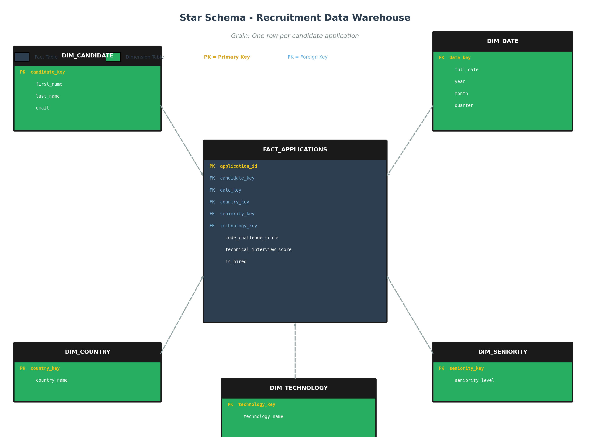

# ETL Workshop - Recruitment Data Warehouse

## Project Overview

This project implements a complete **ETL (Extract, Transform, Load) pipeline** that processes 50,000 candidate application records from a recruitment process. The raw data is transformed and loaded into a **Star Schema Data Warehouse** built on SQLite, enabling analytical queries and KPI generation.

This project simulates a real-world Data Engineering challenge, covering data modeling, ETL logic, analytical thinking, and professional documentation.

## System Architecture

```
CSV (Raw Data) → Extract → Transform → Load → SQLite DW → KPI Dashboard
```

1. **Extract:** Read the raw CSV file and validate data types.
2. **Transform:** Clean data, apply business rules, create dimension tables and fact table with surrogate keys.
3. **Load:** Insert all tables into the SQLite Data Warehouse ensuring referential integrity.

## Star Schema Design



### Grain Definition

> **One row per candidate application.**
> Each record in the fact table represents a single application submitted by a candidate. The same candidate can have multiple applications.

### Fact Table

| Table | Description |
|---|---|
| `fact_applications` | Contains scores, hiring outcome, and foreign keys to all dimensions. |

### Dimension Tables

| Table | Description | Records |
|---|---|---|
| `dim_candidate` | Candidate name and email | ~50,000 |
| `dim_date` | Date breakdown (year, month, quarter) | ~1,646 |
| `dim_country` | Country names | 244 |
| `dim_seniority` | Seniority levels | 7 |
| `dim_technology` | Technology/role names | 24 |

### Design Decisions

- **Surrogate Keys:** All dimension tables use auto-incremented integer keys (`candidate_key`, `date_key`, etc.) instead of natural keys from the CSV. This is a DW best practice for performance and consistency.
- **Date Dimension:** Dates are broken into `year`, `month`, and `quarter` to enable flexible time-based analysis without complex date functions in queries.
- **Candidate Dimension:** Each unique combination of (first_name, last_name, email) is treated as a distinct candidate. Duplicate emails (167 found) represent candidates who applied multiple times — this is valid given our grain definition.
- **is_hired as a fact measure:** The hiring status is stored as an integer (1/0) in the fact table, making aggregation simple and efficient.

## Business Rule

A candidate is considered **HIRED** if:

```
Code Challenge Score >= 7 AND Technical Interview Score >= 7
```

This rule is applied during the **Transform** phase in Python, creating the `is_hired` column (1 = Hired, 0 = Rejected).

## ETL Logic

### Extract (`src/extract.py`)
- Reads the CSV file (semicolon-separated).
- Validates that all 10 expected columns exist.
- Converts `Application Date` from string to datetime.
- Validates that numeric columns are the correct type.

### Transform (`src/transform.py`)
- **Data Quality:** Checks for nulls (none found), strips whitespace from text fields.
- **Business Rule:** Applies the hiring rule to create the `is_hired` column.
- **Dimensions:** Creates 5 dimension tables with surrogate keys.
- **Fact Table:** Maps all natural keys to surrogate keys and builds the final fact table.
- **Integrity Check:** Verifies no null foreign keys exist.

### Load (`src/load.py`)
- Creates a fresh SQLite database.
- Executes the DDL script (`sql/create_tables.sql`) to create all tables.
- Loads dimension tables **first**, then the fact table (to maintain referential integrity).
- Validates row counts after loading.

## Data Quality Assumptions

| Check | Result |
|---|---|
| Null values | 0 found — dataset is complete |
| Duplicate rows | 0 found |
| Duplicate emails | 167 found — kept (multiple applications are valid) |
| Score range | 0-10 (valid) |
| YOE range | 0-30 years (valid) |
| Date range | 2018-01-01 to 2022-07-04 |

## KPIs Generated

All KPIs are queried from the **Data Warehouse**, not from the CSV.

| # | KPI | Key Finding |
|---|---|---|
| 1 | Hires by Technology | Game Development leads with 519 hires |
| 2 | Hires by Year | 2019 was the peak year (1,524 hires) |
| 3 | Hires by Seniority | Intern level has the most hires (985) |
| 4 | Hires by Country Over Years | Trends for USA, Brazil, Colombia, Ecuador |
| 5 | Hiring Rate (%) by Technology | CMS Backend has the highest rate (15.09%) |
| 6 | Average Scores by Seniority | All levels average ~5.0 (uniform distribution) |

## Project Structure

```
etl-workshop-1/
├── data/
│   ├── raw/                  # Original CSV file
│   │   └── candidates.csv
│   └── processed/            # SQLite Data Warehouse
│       └── recruitment_dw.db
├── notebooks/
│   └── eda.ipynb             # Exploratory Data Analysis
├── sql/
│   ├── create_tables.sql     # DDL - Star Schema table creation
│   └── load_tables.sql       # KPI queries
├── diagrams/
│   └── star_schema.png       # Star Schema diagram
├── src/
│   ├── extract.py            # Extract module
│   ├── transform.py          # Transform module
│   ├── load.py               # Load module
│   ├── main.py               # ETL orchestrator
│   └── kpis.py               # KPI queries + visualizations
├── README.md
├── requirements.txt
└── .gitignore
```

## How to Run

### Prerequisites

- Python 3.8+
- pip

### Setup

1. Clone the repository:
   ```bash
   git clone https://github.com/your-username/etl-workshop-1.git
   cd etl-workshop-1
   ```

2. Install dependencies:
   ```bash
   pip install -r requirements.txt
   ```

3. Run the ETL pipeline:
   ```bash
   cd src
   python main.py
   ```

4. Generate KPI visualizations:
   ```bash
   python kpis.py
   ```

5. (Optional) Open the EDA notebook:
   ```bash
   cd ../notebooks
   jupyter notebook eda.ipynb
   ```

## Tech Stack

- **Python** — ETL logic and data processing
- **Pandas** — Data manipulation and transformation
- **SQLite** — Data Warehouse
- **Matplotlib / Seaborn** — Visualizations
- **Jupyter Notebook** — Exploratory Data Analysis
- **SQL** — Analytical queries

## Sample Output

### ETL Pipeline Execution
```
************************************************************
   ETL PIPELINE - Recruitment Data Warehouse
************************************************************

STEP 1: EXTRACTION
  Rows loaded: 50,000
  Column validation: PASSED

STEP 2: TRANSFORMATION
  Hiring rule applied:
    - Hired:    6,698 (13.4%)
    - Rejected: 43,302 (86.6%)

STEP 3: LOAD
  fact_applications: 50,000 records loaded

   ETL PIPELINE COMPLETED SUCCESSFULLY!
************************************************************
